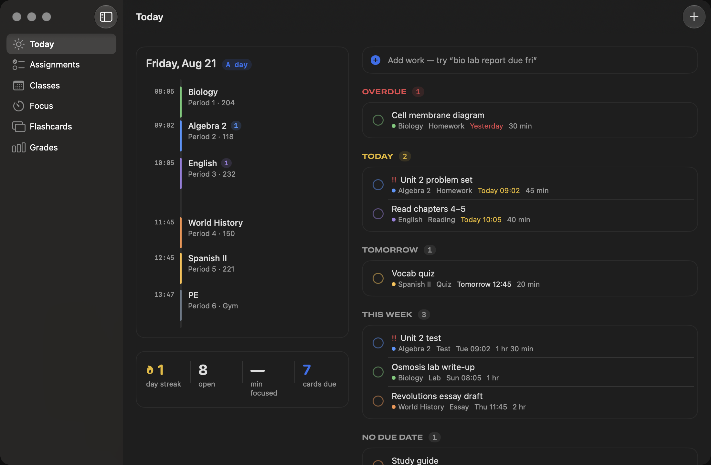

# Locker

A macOS app for keeping track of school: what's due, when classes meet, what to
study, and where your grades actually stand.

Native SwiftUI and SwiftData. Everything lives on your Mac — no account, no
server, nothing to sign up for. Google Classroom sync is optional.



## What it does

**Today** — the day drawn to scale. Class blocks are sized and placed by their
real times, with a line marking the current moment, so a glance answers "where
am I and what's next". Everything due is grouped beside it: overdue, today,
tomorrow, this week.

**Add work by typing it.** `bio lab report due fri` becomes a lab report for
Biology due Friday. It reads class names and nicknames, dates (`tomorrow`,
`next tue`, `9/18`, `oct 12`), times (`at 3pm`, `11:59pm`), type
(test, quiz, essay, reading…), priority (`!!`), and effort (`45m`, `2 hours`).
⌃⌥Space opens the box from any app.

**Classes** — meeting days, times, room, teacher, color, and A/B block schedules.
If the rotation drifts after a snow day, one click in Settings resets it.

**Assignments** — a list grouped by urgency, or a week grid you can drag work
around in.

**Focus** — a pomodoro timer that can be pointed at a specific assignment and
keeps a record of the minutes you actually put in.

**Flashcards** — decks with SM-2 spaced repetition. Rate a card Again / Hard /
Good / Easy and it comes back exactly when it should.

**Grades** — weighted categories or straight points, current grade and letter,
and the question that actually gets asked: *what do I need on the final?*

**Reminders** — the night before, the morning of, a set number of hours before
a due time, plus an earlier heads-up for tests and projects. Every one of them
is adjustable or can be turned off.

## Running it

Requires macOS 15 or later. To build from source you need Xcode 16+ and
[XcodeGen](https://github.com/yonaskolb/XcodeGen) (`brew install xcodegen`).

```sh
xcodegen generate
open Locker.xcodeproj
```

Or build a release build and a distributable zip:

```sh
./scripts/release.sh 1.0
```

Run the tests:

```sh
xcodebuild -project Locker.xcodeproj -scheme Locker -destination 'platform=macOS' test
```

To poke around the interface without typing in a whole schedule, launch with
`LOCKER_SEED=1` set and it will fill an empty database with a sample week.

## Adding work from a screenshot

Screenshot an assignment page or your whole schedule — Google Classroom, Skyward,
Canvas — and drop it into Locker (⇧⌘I). It reads the details and shows them for
review before anything is saved. Which kind of screenshot it is, is worked out
from the text: several classes pinned to periods is a schedule, anything else is
an assignment.

A schedule import reads the course name, period, term, teacher, room, times, and
meeting days for every row, and handles schools that run a different timetable
each semester — Locker then shows whichever one is currently running.

Familiar layouts (a detail line per class, like "Period 3 - SEMESTER 1") are read
by pattern alone, with no model involved. Anything else goes to the on-device
model, which is told to find the rows and label the columns and nothing more.
Every value still has to appear in the screenshot to survive, and a value that
lands in the wrong column produces nothing rather than a plausible mistake — a
start time of 7:45 will not become "period 7". Every row is editable before it is
saved, and if the wrong reading is chosen there's a button to read the screenshot
the other way.

The pipeline is deliberately lopsided, because a planner full of wrong dates is
worse than an empty one:

1. **Vision reads the pixels.** Every line of text, with its position. Columns are
   detected so a sidebar can't cut a title in half.
2. **The on-device model only labels.** It says which text is the due date; it
   never converts, calculates, or writes a value. Guided generation constrains it
   to a fixed set of slots, so there is no free-form output to misparse, and
   decoding is greedy so the same screenshot gives the same answer.
3. **Every slot is checked against the screenshot.** A value that isn't found in
   the recognized text is dropped and listed as ignored. A made-up due date cannot
   reach the database.
4. **Swift does the interpreting.** `"Aug 26"` becomes a date, `"4 points"` becomes
   a number — in tested code, not in the model.

Needs Apple Intelligence for step 2. Without it, Locker falls back to matching the
labels school software prints ("Due …", "N points"), and everything else is
unchanged. Nothing is ever uploaded.

## Icon

The app icon is an [Icon Composer](https://developer.apple.com/documentation/xcode/creating-your-app-icon-using-icon-composer)
document at `Locker/Resources/Locker.icon`. To replace it:

```sh
./scripts/use-icon.sh /path/to/YourIcon.icon
```

## Google Classroom

Optional, read-only, and set up in Settings → Sync. See
[SETUP-GOOGLE.md](SETUP-GOOGLE.md) for the five-minute walkthrough.

Your notes, priorities, and estimates are never overwritten by a sync, and
nothing is ever deleted because it vanished upstream.

## Updates

Settings → Updates checks this repository's GitHub releases and can install a
newer version in place. Set the repository there (`owner/name`) if it isn't
already filled in.

## How it's put together

```
Locker/
  App/         Entry point, navigation, menu bar
  Models/      SwiftData models
  Domain/      Pure Swift, no UI or database: the parser, SM-2, grade math,
               schedule/A-B logic, reminder timing, streaks — all unit tested
  Services/    Persistence, notifications, keychain, OAuth, updates, and the
               import layer
  Features/    One folder per screen
```

`Domain/` deliberately imports neither SwiftUI nor SwiftData, which is what
makes the parts most likely to be wrong cheap to test.

Imports go through an `ImportSource` protocol rather than being wired to Google
Classroom directly, so another system (a district's Skyward, say) is one new
source rather than a rewrite.

## License

Personal project. Use it however you like.
